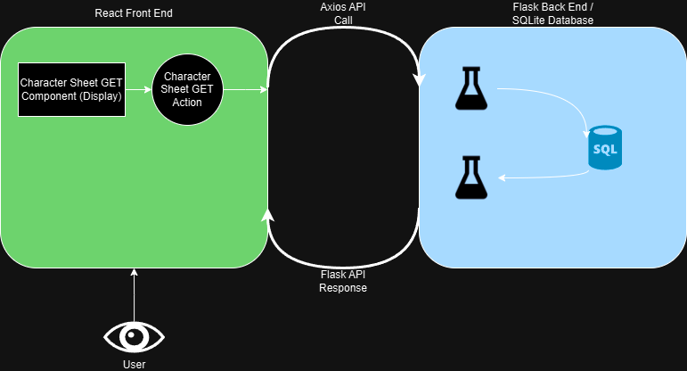

# Shadowsite

This project was created by Brian Lederman, using Flask for the backend, SQLite for the database, and React for the frontend.

## Available Scripts

In the project directory, you can run:

### `npm start`

Runs the app in the development mode.\
Open [http://localhost:3000](http://localhost:3000) to view it in your browser.

The page will reload when you make changes.\
You may also see any lint errors in the console.

### `python -m backend.main`

Launches the backend in debug mode.\

The backend will not reload automatically when changes are made, and must be restarted.

## Diagrams

Logic flow PoC

## Learn More

You can learn more in the [Shadowsite documentation](https://docs.google.com/document/d/1StbIFt6FPAbcIprQRGOBmZ4AXzxWjGNd2H437xE5fGY/edit?usp=sharing).

To learn React, check out the [React documentation](https://reactjs.org/).

To learn Flask, check out the [Flask documentation](https://flask.palletsprojects.com/en/3.0.x/)

To learn SQLite, check out the [SQLite documentation](https://www.sqlite.org/docs.html)

To get summaries of everything that may or may not be true, use [ChatGPT](https://chatgpt.com/)
